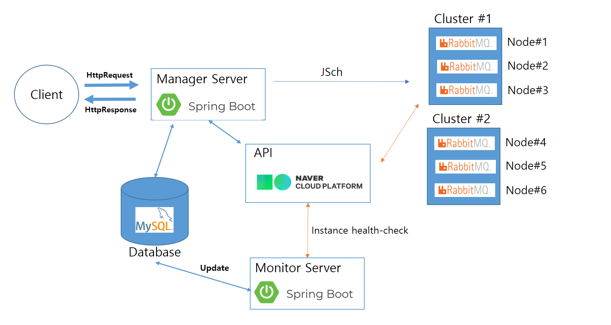

# Infra

* 인프라를 위와 같이 설계한 이유

  * `사용자에게서 요청을 받고 처리하는 Manager Server`가 있어야 하고, 동시에 `주기적으로 VM의 상태를 확인할 수 있는 Monitor Server가 따로 있으면 좋겠다`고 생각했습니다. Role을 구분하고 싶었습니다.

  

* Manager Server는 요청이 들어온 것에 대해서만 처리를 하고, Monitor Server는 VM의 상태를 확인하며 개발자가 설정한 값에 의해 자동화되어 처리됩니다.

* 사용자에게서 요청을 받고, 처리한 정보는 DataBase에 저장을 해줍니다.

* Monitor Server는 Database 상의 Data와 Ncloud API를 통해 얻은 정보만을 가지고 유령 포트나, 유령 클러스터 제거, 잘못 저장된 데이터 제거 및 Auto-Scaling 기능을 수행합니다. 