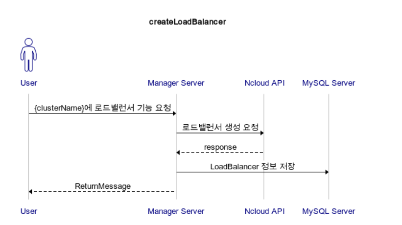

# Sequence Diagram

> ### Cluster 생성/반납

* **createCluster : 사용자에게서 클러스터 생성 요청을 받으면 만들어 줍니다. 이 때, 로드밸런서 옵션은 없습니다.**

* **terminateCluster : 클러스터를 반납합니다. 로드밸런서 옵션이 있었다면 로드밸런서 반납도 이루어집니다. 인스턴스들이 중지되어 있지 않다면 중지와 반납까지 이루어집니다.**

> ### LoadBalancer 생성/반납

* **createLoadBalancer : 사용자에게서 로드밸런서 기능을 추가해달라는 요청을 받으면 해당 클러스터에 로드밸런서 옵션을 추가합니다.**

* **/api/deleteLoadBalancer : 사용자에게서 로드밸런서 기능을 삭제해달라는 요청을 받으면 해당 클러스터에서 로드밸런서 옵션을 제거합니다.**

> ### 클러스터 정보 조회

* **/api/detail/{clusterName} : 클러스터에 대한 상세 정보를 조회합니다.**
* **/api/findClusters : 사용자가 가지고 있는 클러스터의 이름 목록을 출력합니다.**

> ### On/Off AutoScale

* **/api/offAutoScale : auto-scaling 기능을 비활성화 합니다.**
* **/api/onAutoScale : auto-scaling 기능을 활성화 합니다.**

> ### Scale

* **/api/scaleIn : 수동으로 scaleIn 을 수행합니다.**
* **/api/scaleOut : 수동으로 scaleOut 을 수행합니다.**

